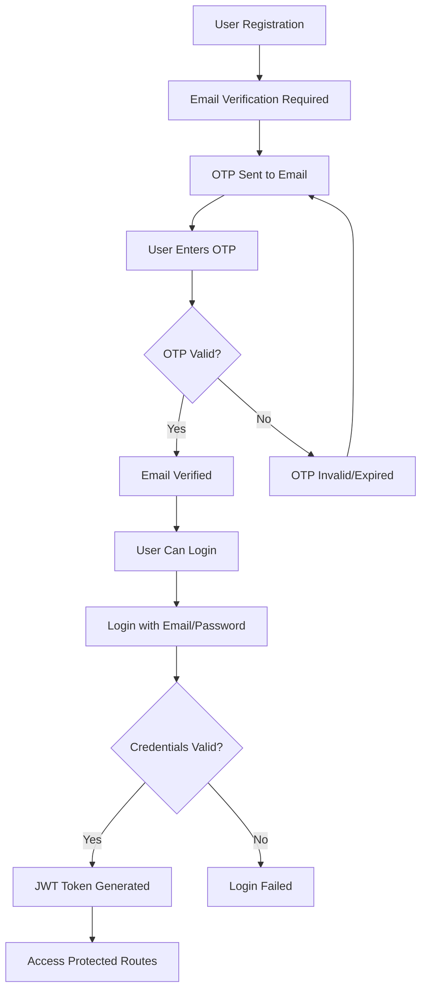
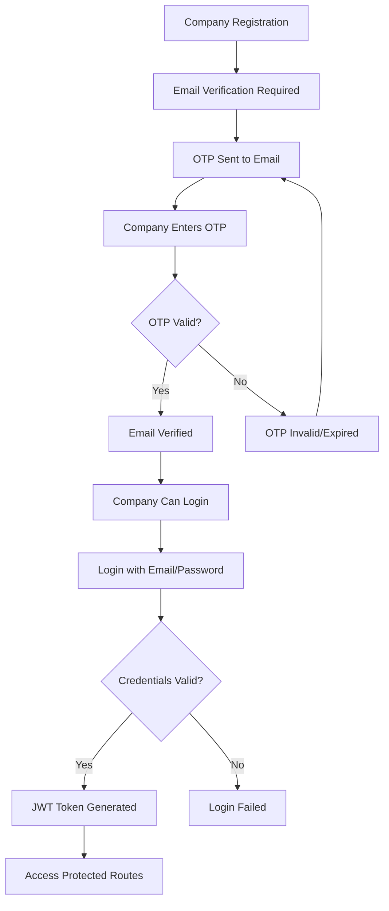

# Authentication Documentation

## Overview

The Job Portal Backend API uses JWT (JSON Web Tokens) for authentication. The system supports two types of authentication:

1. **User Authentication** - For job seekers
2. **Company Authentication** - For employers

## Table of Contents

- [Authentication Flow](#authentication-flow)
- [JWT Tokens](#jwt-tokens)
- [Email Verification](#email-verification)
- [Password Security](#password-security)
- [Middleware](#middleware)
- [Error Handling](#error-handling)
- [Security Best Practices](#security-best-practices)

---

## Authentication Flow

### User Authentication Flow



### Company Authentication Flow



---

## JWT Tokens

### Token Structure

JWT tokens contain the following payload:

```json
{
  "id": "user_or_company_id",
  "iat": 1704067200,
  "exp": 1706659200
}
```

### Token Configuration

| Property | Value | Description |
|----------|-------|-------------|
| **Algorithm** | HS256 | HMAC SHA-256 |
| **Expiration** | 30 days | Token validity period |
| **Secret** | Environment variable | JWT_SECRET from .env |

### Token Generation

```javascript
// User token generation
const generateToken = (id) => {
  return jwt.sign({ id }, process.env.JWT_SECRET, {
    expiresIn: "30d",
  });
};

// Usage
const token = await generateToken(user._id);
```

### Token Verification

```javascript
// Middleware token verification
const decodedToken = jwt.verify(token, process.env.JWT_SECRET);
const user = await User.findById(decodedToken.id).select("-password");
```

---

## Email Verification

### OTP Generation

```javascript
// Generate 6-digit OTP
export const generateOTP = () => {
  return Math.floor(100000 + Math.random() * 900000).toString();
};
```

### OTP Configuration

| Property | Value | Description |
|----------|-------|-------------|
| **Length** | 6 digits | OTP code length |
| **Expiration** | 10 minutes | OTP validity period |
| **Format** | Numeric | 100000-999999 |

### OTP Storage

```javascript
// OTP storage in user/company document
{
  otp: "123456",
  otpExpires: new Date(Date.now() + 10 * 60 * 1000) // 10 minutes
}
```

### Email Sending

```javascript
// SMTP configuration
const transporter = nodemailer.createTransporter({
  host: process.env.SMTP_HOST,
  port: process.env.SMTP_PORT,
  secure: process.env.SMTP_SECURE === 'true',
  auth: {
    user: process.env.SMTP_USER,
    pass: process.env.SMTP_PASS,
  }
});

// Send OTP email
const sendVerificationMail = async (email, otp) => {
  await transporter.sendMail({
    from: process.env.SMTP_USER,
    to: email,
    subject: "Email Verification Code",
    html: `<p>Your verification code is: <strong>${otp}</strong></p>`
  });
};
```

---

## Password Security

### Password Hashing

```javascript
// Hash password using bcrypt
const hashedPassword = await bcrypt.hash(password, 10);

// Verify password
const isPasswordValid = await bcrypt.compare(password, hashedPassword);
```

### Password Requirements

| Requirement | Description |
|-------------|-------------|
| **Minimum Length** | 6 characters |
| **Hashing Algorithm** | bcrypt with salt rounds 10 |
| **Storage** | Never store plain text passwords |

### Password Change Flow

```javascript
// Change password endpoint
export const changePassword = async (req, res) => {
  const { currentPassword, newPassword } = req.body;
  const userId = req.userData._id;
  
  // Get user
  const user = await User.findById(userId);
  
  // Verify current password
  const isMatch = await bcrypt.compare(currentPassword, user.password);
  
  if (isMatch) {
    // Hash new password
    const hashedPassword = await bcrypt.hash(newPassword, 10);
    
    // Update password
    await User.findByIdAndUpdate(userId, { password: hashedPassword });
    
    return res.status(200).json({
      success: true,
      message: "Password changed successfully"
    });
  }
  
  return res.status(400).json({
    success: false,
    message: "Invalid current password"
  });
};
```

---

## Middleware

### User Authentication Middleware

```javascript
// userAuthMiddleware.js
import jwt from "jsonwebtoken";
import User from "../models/User.js";

const userAuthMiddleware = async (req, res, next) => {
  try {
    const token = req.headers.token;

    if (!token) {
      return res.status(401).json({ 
        message: "Unauthorized login again" 
      });
    }

    const decodedToken = jwt.verify(token, process.env.JWT_SECRET);
    const user = await User.findById(decodedToken.id).select("-password");

    if (!user) {
      return res.status(404).json({ 
        message: "User not found" 
      });
    }

    req.userData = user;
    next();
  } catch (error) {
    return res.status(401).json({ 
      message: "Unauthorized login again" 
    });
  }
};
```

### Company Authentication Middleware

```javascript
// companyAuthMiddleware.js
import jwt from "jsonwebtoken";
import Company from "../models/Company.js";

const companyAuthMiddleware = async (req, res, next) => {
  try {
    const token = req.headers.token;

    if (!token) {
      return res.status(401).json({ 
        message: "Unauthorized login again" 
      });
    }

    const decodedToken = jwt.verify(token, process.env.JWT_SECRET);
    const company = await Company.findById(decodedToken.id).select("-password");

    if (!company) {
      return res.status(404).json({ 
        message: "User not found" 
      });
    }

    req.companyData = company;
    next();
  } catch (error) {
    return res.status(401).json({ 
      message: "Unauthorized login again" 
    });
  }
};
```

### Middleware Usage

```javascript
// Apply middleware to protected routes
router.get("/user-data", userAuthMiddleware, fetchUserData);
router.post("/apply-job", userAuthMiddleware, applyJob);
router.post("/post-job", companyAuthMiddleware, postJob);
router.get("/company-data", companyAuthMiddleware, fetchCompanyData);
```

---

## Error Handling

### Authentication Errors

| Error Code | Description | Response |
|------------|-------------|----------|
| 401 | No token provided | `{ "message": "Unauthorized login again" }` |
| 401 | Invalid token | `{ "message": "Unauthorized login again" }` |
| 401 | Token expired | `{ "message": "Unauthorized login again" }` |
| 404 | User/Company not found | `{ "message": "User not found" }` |

### Email Verification Errors

| Error Code | Description | Response |
|------------|-------------|----------|
| 400 | Email not verified | `{ "message": "Email not verified. A new OTP has been sent." }` |
| 400 | Invalid OTP | `{ "message": "Invalid or expired OTP" }` |
| 400 | OTP expired | `{ "message": "Invalid or expired OTP" }` |

### Password Errors

| Error Code | Description | Response |
|------------|-------------|----------|
| 400 | Invalid password | `{ "message": "Invalid password" }` |
| 400 | Password mismatch | `{ "message": "Invalid current password" }` |

---

## Security Best Practices

### 1. Environment Variables

```env
# JWT Configuration
JWT_SECRET=your_super_secret_jwt_key_here

# SMTP Configuration
SMTP_HOST=smtp.gmail.com
SMTP_PORT=587
SMTP_USER=your_email@gmail.com
SMTP_PASS=your_app_specific_password
SMTP_SECURE=false
```

### 2. Token Security

- **Never expose JWT secret** in client-side code
- **Use HTTPS** in production
- **Implement token refresh** for long-lived sessions
- **Log out users** on token expiration

### 3. Password Security

- **Hash passwords** before storing
- **Use strong salt rounds** (10+ for bcrypt)
- **Implement password policies**
- **Never log passwords**

### 4. Email Security

- **Use secure SMTP** connections
- **Implement rate limiting** for OTP requests
- **Set OTP expiration** times
- **Validate email formats**

### 5. Input Validation

```javascript
// Validate email format
const emailRegex = /^[^\s@]+@[^\s@]+\.[^\s@]+$/;
if (!emailRegex.test(email)) {
  return res.status(400).json({
    success: false,
    message: "Invalid email format"
  });
}

// Validate password strength
if (password.length < 6) {
  return res.status(400).json({
    success: false,
    message: "Password must be at least 6 characters"
  });
}
```

---

## API Endpoints

### Authentication Endpoints

#### User Authentication

| Method | Endpoint | Description | Auth Required |
|--------|----------|-------------|---------------|
| POST | `/user/register-user` | Register new user | ❌ |
| POST | `/user/login-user` | User login | ❌ |
| POST | `/user/verify-otp` | Verify email OTP | ❌ |
| GET | `/user/user-data` | Get user data | ✅ |
| POST | `/user/change-password` | Change password | ✅ |

#### Company Authentication

| Method | Endpoint | Description | Auth Required |
|--------|----------|-------------|---------------|
| POST | `/company/register-company` | Register new company | ❌ |
| POST | `/company/login-company` | Company login | ❌ |
| POST | `/company/verify-otp` | Verify email OTP | ❌ |
| GET | `/company/company-data` | Get company data | ✅ |
| POST | `/company/change-password` | Change password | ✅ |

---

## Request Examples

### User Registration

```bash
curl -X POST http://localhost:5000/user/register-user \
  -F "name=John Doe" \
  -F "email=john@example.com" \
  -F "password=password123" \
  -F "image=@profile.jpg"
```

**Response:**
```json
{
  "success": true,
  "message": "Registration successful. Please verify your email with the OTP sent.",
  "userData": {
    "_id": "user_id",
    "name": "John Doe",
    "email": "john@example.com",
    "image": "image_url"
  }
}
```

### Email Verification

```bash
curl -X POST http://localhost:5000/user/verify-otp \
  -H "Content-Type: application/json" \
  -d '{"email": "john@example.com", "otp": "123456"}'
```

**Response:**
```json
{
  "success": true,
  "message": "Email verified successfully",
  "userData": {
    "_id": "user_id",
    "name": "John Doe",
    "email": "john@example.com",
    "image": "image_url"
  },
  "token": "jwt_token_here"
}
```

### User Login

```bash
curl -X POST http://localhost:5000/user/login-user \
  -H "Content-Type: application/json" \
  -d '{"email": "john@example.com", "password": "password123"}'
```

**Response:**
```json
{
  "success": true,
  "message": "Login successful",
  "userData": {
    "_id": "user_id",
    "name": "John Doe",
    "email": "john@example.com",
    "image": "image_url",
    "isEmailVerified": true
  },
  "token": "jwt_token_here"
}
```

### Access Protected Route

```bash
curl -X GET http://localhost:5000/user/user-data \
  -H "token: jwt_token_here"
```

**Response:**
```json
{
  "success": true,
  "message": "user data fetched successfully",
  "userData": {
    "_id": "user_id",
    "name": "John Doe",
    "email": "john@example.com",
    "image": "image_url",
    "resume": "resume_url",
    "isEmailVerified": true
  }
}
```

---

## Troubleshooting

### Common Issues

1. **"Unauthorized login again"**
   - Check if token is provided in headers
   - Verify token is valid and not expired
   - Ensure JWT_SECRET is correct

2. **"Email not verified"**
   - User must verify email before login
   - Check if OTP was sent successfully
   - Verify SMTP configuration

3. **"Invalid or expired OTP"**
   - OTP expires after 10 minutes
   - Check if OTP is correct
   - Request new OTP if expired

4. **"User not found"**
   - User might have been deleted
   - Check if user ID in token is valid
   - Verify database connection

### Debug Steps

1. **Check Environment Variables**
   ```bash
   echo $JWT_SECRET
   echo $SMTP_HOST
   ```

2. **Verify Database Connection**
   ```javascript
   // Check if user exists
   const user = await User.findById(userId);
   console.log('User found:', user);
   ```

3. **Test JWT Token**
   ```javascript
   // Decode token without verification
   const decoded = jwt.decode(token);
   console.log('Token payload:', decoded);
   ```

4. **Check SMTP Configuration**
   ```javascript
   // Test SMTP connection
   transporter.verify((error, success) => {
     if (error) {
       console.log('SMTP Error:', error);
     } else {
       console.log('SMTP Ready:', success);
     }
   });
   ```

---

## Security Checklist

- [ ] JWT_SECRET is set and secure
- [ ] Passwords are hashed with bcrypt
- [ ] Email verification is required
- [ ] OTP expiration is implemented
- [ ] HTTPS is used in production
- [ ] Input validation is implemented
- [ ] Error messages don't leak sensitive info
- [ ] Rate limiting is implemented
- [ ] CORS is properly configured
- [ ] Database connections are secure
